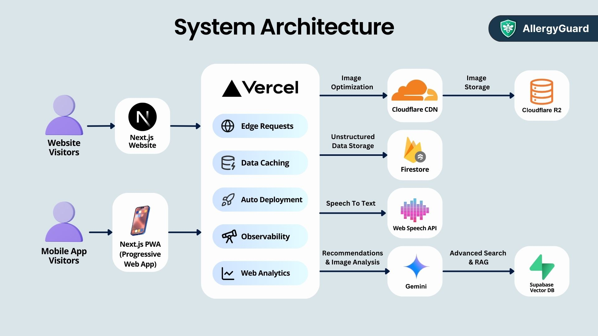

# AllergyGuard 🛡️🐝

**"Because every bite matters ~"**

AllergyGuard is an AI-powered, comprehensive mobile (PWA) and web application designed to empower parents, caregivers, and daycare centers in managing children's food allergies effectively. It aims to minimize the risks of allergic reactions through prevention, education, and rapid emergency response tools.

## The Problem

Food allergies are a significant and growing health concern globally, particularly in regions like Malaysia where studies show **1 in 5 people** suffer from allergy symptoms, a number projected to hit **3 in 5 within a decade**. Children are especially vulnerable due to immature immune systems and smaller bodies, facing risks ranging from mild discomfort to life-threatening anaphylaxis. Compounding this issue:

- There is currently **no cure** for food allergies, making prevention paramount.
- Parents struggle (approx. **60%**) to find safe and healthy meal options.
- Accidental exposure is common (approx. **50%** in schools), often due to cross-contamination or lack of awareness.
- Understanding food labels can be difficult (approx. **70%** struggle) due to technical terms or foreign languages.
- Managing allergies becomes complex when children are under the care of others (e.g., daycare centers), requiring seamless communication.
- Children and even caregivers often have **low knowledge** about managing food allergies effectively.

AllergyGuard addresses these challenges head-on.

## Key Features

AllergyGuard offers a suite of integrated features powered by AI:

- **👶 Allergy Care & Management:**
  - Create centralized digital profiles for multiple children detailing their specific allergies, severity, symptoms, medications, and emergency action plans.
  - Establish a clear communication bridge between parents and caregivers (family, individuals).
- **🏫 Classroom Management (B2B Focus):**
  - Dedicated module for daycare centers/schools to manage multiple classrooms and children.
  - Allows teachers/caretakers to easily access critical allergy information for all children in their care, ensuring appropriate actions and preventing accidental exposure in group settings.
  - Parents can securely connect their child's profile to a specific classroom using a unique code.
- **🍽️ AI-Powered Safe Meal Planning:**
  - Get personalized, safe meal and recipe suggestions based on the allergy profiles of _multiple_ selected children.
  - **Recipe Modification:** Upload or paste existing recipes. AI analyzes ingredients, detects potential allergens specific to the selected children, and suggests safe, suitable substitutions (e.g., suggesting roasted soybeans for peanuts, vegan butter/almond milk for dairy).
- **🔍 Multilingual Ingredient Scanner (OCR with Gemini):**
  - Take a photo or upload an image of a food product's nutrition label/ingredient list.
  - AI analyzes the text (handling multiple languages like English, Bahasa Malaysia, Chinese) to detect potential allergens relevant to the selected children's profiles.
  - Provides clear alerts if an ingredient is unsafe for any selected child.
- **🚨 Emergency Allergy Support:**
  - **AI Symptom Analysis:** Describe symptoms via text input or **multilingual voice input** (using Web Speech API).
  - **Smart Diagnosis (RAG Model):** AI (powered by Google Gemini and a Retrieval-Augmented Generation model trained on trusted medical databases) analyzes symptoms against medical knowledge to suggest possible diagnoses/allergic reactions and their likelihood.
  - **Step-by-Step Guidance:** Provides clear, actionable emergency protocols and visual guides based on the potential diagnosis.
  - **Quick Contacts:** Easy access to call emergency services (e.g., 999) and pre-filled information to convey to emergency responders.
- **🎮 Educative Game (Allergy Ninja):**
  - An engaging and interactive game inspired by Fruit Ninja.
  - Children choose their profile ('ninja') and slice only foods that are safe for _their specific allergies_, while avoiding their known allergens.
  - Trains reflexes and reinforces allergen identification in a fun way.
  - Includes **leaderboards** and **badges** to motivate learning and engagement.

## Target Audience

- **Parents** of children with food allergies.
- **Individual Caregivers** (family members, babysitters).
- **Educational Institutions** (Daycare Centers, Preschools, Schools).

## Tech Stack

- **Framework**: Next.js 14+ (with App Router)
- **Programming Language**: TypeScript
- **Styling**: Tailwind CSS
- **UI Components**: shadcn/ui, Radix UI
- **Backend**: Next.js API Routes
- **PWA**: Progressive Web App implementation for offline support and native app-like experience on mobile devices
- **Database**:
  - Firestore (for unstructured data like profiles, recipes)
  - PostgreSQL (managed via Vercel Postgres or Supabase)
  - Supabase Vector DB (for RAG embeddings in Smart Diagnosis)
- **ORM**: Drizzle ORM
- **Authentication**: Lucia Auth (Username/Password, potentially OAuth)
- **State Management**: Zustand
- **Schema Validation**: Zod
- **AI**: Google Generative AI (Gemini for meal planning, analysis, RAG)
- **Speech Recognition**: Web Speech API (Browser-native)
- **Deployment**: Vercel
- **Image Handling**: Cloudflare R2 (Storage), Cloudflare CDN (Optimization/Delivery)

## System Architecture

AllergyGuard utilizes a modern web architecture deployable as both a website and a Progressive Web App (PWA) for mobile access. Key components include:

- **Frontend (Next.js/React)**: Provides the user interface and interacts with backend services.
- **Backend (Next.js API Routes / Vercel Serverless Functions)**: Handles business logic, authentication, and data processing.
- **Databases**: Firestore for flexible document storage, PostgreSQL for structured relational data (auth), and Supabase Vector DB for AI-powered semantic search (RAG).
- **AI Models (Google Gemini/RAG)**: Power features like meal planning, ingredient analysis, and smart diagnosis.
- **Deployment & Infrastructure (Vercel, Cloudflare)**: Ensures scalability, performance, and reliability.



## Getting Started

### Prerequisites

- Node.js 18+ or Bun 1.0+
- Access to Google Cloud Platform for Firestore Admin SDK and Google Generative AI API Keys.
- PostgreSQL database instance (e.g., Vercel Postgres, Supabase, or local).
- Cloudflare account for R2 and CDN (Optional, for image handling).
- Supabase account for Vector DB (Optional, needed for RAG functionality).

### Installation

1.  Clone the repository:
    ```bash
    git clone https://github.com/haocloo/AllergyGuard.git
    cd AllergyGuard
    ```
2.  Install dependencies:
    ```bash
    # Using Bun (Recommended)
    bun install
    # Or using npm
    # npm install
    # Or using yarn
    # yarn install
    ```
3.  Configure environment variables:
    - Copy `.env.sample` to `.env`.
    - Fill in the necessary API keys and database connection strings (Firestore service account key, Google AI API Key, Postgres URL, Auth secrets, etc.).
4.  Set up the database schema and migrations:

    ```bash
    # Using Bun
    bun db:gen
    bun db:mig

    # Or using npm/yarn scripts if configured in package.json
    # npm run db:gen && npm run db:mig
    ```

### Running the Application

#### Development Server

```bash
# Using Bun
bun dev
# Or using npm/yarn
# npm run dev / yarn dev
```

Open [http://localhost:3000](http://localhost:3000) in your browser.

#### Production Build

```bash
# Using Bun
bun build
bun start
# Or using npm/yarn
# npm run build && npm run start
```

#### Authentication Management (Drizzle ORM with PostgreSQL)

```bash
# Launch Drizzle Studio to view/manage data
bun db:studio

# Generate SQL migration files based on schema changes
bun db:gen

# Apply pending migrations to the database
bun db:mig
```

## Project Structure

- `/app`: Next.js application routes (App Router), API endpoints, and UI pages.
- `/components`: Reusable UI components (built with shadcn/ui, Radix UI).
- `/lib`: Utility functions, constants, and configurations (e.g., database connections, auth setup).
- `/db`: Drizzle ORM schema definitions and migration files.
- `/services`: Higher-level functions interacting with external APIs or abstracting database operations.
- `/hooks`: Custom React hooks.
- `/public`: Static assets (images, fonts, etc.).
- `/styles`: Global CSS files.

## User Roles

- **Parent**: Manages profiles for their children, uses meal planning, scanner, game, and emergency features for their linked children.
- **Caretaker / Teacher**: Manages assigned classrooms, views allergy profiles of children within those classrooms, uses meal planning and emergency features in the context of the classroom. Can be added by parents or manage institution accounts.
- **Admin**: Manages the overall system, including user accounts, classrooms, and settings.

## Contributing

We welcome contributions! Please follow these steps:

1.  Fork the repository.
2.  Create your feature branch (`git checkout -b initials/YourAmazingFeature` or `fix/IssueDescription`).
3.  Commit your changes (`git commit -m 'Add: Implement YourAmazingFeature'`).
4.  Push to the branch (`git push origin initials/YourAmazingFeature`).
5.  Open a Pull Request against the `dev` branch.

Please ensure your code adheres to the project's linting and formatting standards.

## License

This project is licensed under the [MIT License](LICENSE).
